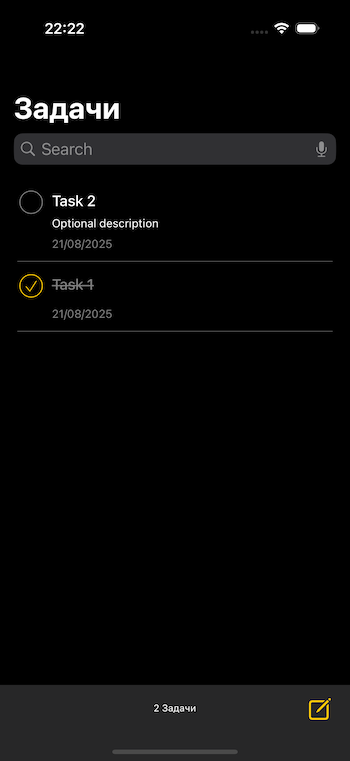
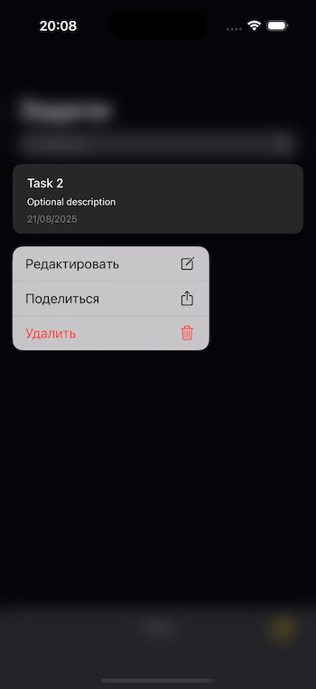
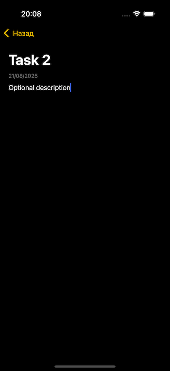

# ToDoListApp
A simple task manager.

## Features
* VIPER Architecture.
* Dependency Injection.
* Core Data.
* CRUD operations on a background context.
* Database seeding with remote sample data.
* Diffable Data Source.
* Unit Testing (XCTest).

## Screens
### TaskList
 

### EditTask
